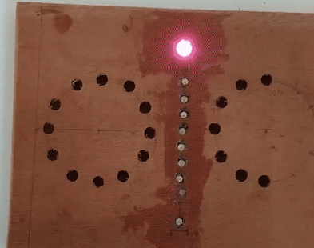
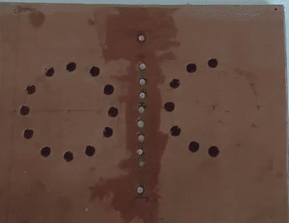

# Project CO2 Monitoring Device for French Electrical Production

This project involves the creation of a device that displays real-time CO2 emissions impact from electrical production in France. It uses an ESP8266 microcontroller and a set of LEDs to visually represent the data.

## Table of Contents

- [Introduction](#introduction)
- [How It Works](#how-it-works)
- [Required](#required)
- [Getting started](#getting-started)
- [Usage](#usage)
- [Configuration](#configuration)

## Introduction

Climate change is a major challenge humanity is facing, and reducing CO2 emissions is crucial to mitigate its effects. This project aims to raise awareness about the impact of electrical production on CO2 emissions in France.
This project is a box that displays the carbon impact of French electricity production in real time using a set of LEDs.

## How It Works

This system uses real-time electrical production data from RTE to compute and display the associated carbon footprint. It relies on predefined carbon equivalence values for generating one kilowatt-hour of electricity in each sector.

The total carbon emissions are determined by multiplying the production share in each sector by the respective carbon equivalence value. In case of an error in obtaining the energy mix, a predetermined value of mean production share by sector.

The formula for calculating the global carbon footprint $(eCO_2)_{global}$ is as follows:

$$(eCO_2)_{global} = \sum_{i\ \in\ product\_sector} (eCO_2)_{sector\_i} \times \frac{Product_{\ i}}{Product_{\ total}}$$

| Electricity Generation Sector | Carbon Emissions Equivalency (g of eCO2 per 1 kWh) | Average Power Output (MW) |
| :---------------------------: | :------------------------------------------------: | :-----------------------: |
|       Fossil Hard Coal        |                       1 060                        |            456            |
|          Fossil Oil           |                        730                         |            122            |
|          Fossil Gas           |                        418                         |           4 238           |
|           Bioenergy           |                        494                         |           1 123           |
|             Wind              |                         14                         |           4 299           |
|             Solar             |                         43                         |           1 696           |
|            Nuclear            |                         6                          |          39 924           |
|             Hydro             |                         6                          |           6 920           |

**Data Sources**: [economiedenergie.fr](https://www.economiedenergie.fr/les-emissions-de-co2-par-energie/), [youmatter.world](https://youmatter.world/fr/co2-kwh-electricite-france-mix-electrique/), and historic RTE data

## Required

To build this device, you will need the following components:

- ESP8266
- A set of 10 LEDs (e.g., RGB LEDs)
- USB power supply for the ESP8266
- Arduino IDE configure for ESP8266 Card
- Internet access to making calls to three APIs: :
  - [rte-france.com/open_api/actual_generation/v1/generation_mix_15min_time_scale](https://digital.iservices.rte-france.com/open_api/actual_generation/v1/generation_mix_15min_time_scale) **1 call every 10 minutes**
  - [rte-france.com/token/oauth](https://digital.iservices.rte-france.com/token/oauth) **1 call every 2 hours**
  - [worldtimeapi.org/api/timezone/Europe/Paris](https://digital.iservices.rte-france.com/open_api/actual_generation/v1/generation_mix_15min_time_scale) **1 call every 4 hours**

## Getting started

1. **Create an RTE API Account**

   - Visit the website [data.rte-france.com](https://data.rte-france.com/) and create an account.
   - Create an application with associated APIs, specifically the "Actual Generation" API.

2. **Hardware Setup**

   - Solder the 10 LEDs together, ensuring you follow the correct pin connections.
   - Connect the Vcc pin to 5V, the GND (Ground) pin to GND, and the "dint" pin to pin 2 on your board (you can customize the pin in "led.h": `#define PIN` - _please note that these pins may not match the board markings; verify online_).

3. **Clone this GitHub Repository to Your Computer**

   ```bash
   git clone https://github.com/your-username/co2-electrical-production-france.git#CO2_EMISION_ELEC_PRODUCTION
   ```

4. **Configure API Credentials**

   Inside the `src` folder, create a file named `secret.cpp` and add the following code:

   ```cpp
   #include "secret.h"

   const char SSID[] = "${name_wifi}";
   const char PASSWORD[] = "${code_wifi}";
   const char RTE_PASS[] = "Basic ${identifiant_secret_RTE}";
   ```

   Note: The `identifiant_secret_RTE` can be found in the 'application' section on the RTE website. Please click on the 'copier 64' button.

5. **Upload the Code**

   Connect the card to the laptop and upload the code using the Arduino IDE.

## Usage

- When the board is connected, it will make an attempt to establish a Wi-Fi connection. During this process, it will blink as demonstrated below, continuing until it successfully.



- If the board successfully connects to the Wi-Fi network, it can initiate different requests. When a request succeeds, the LED will flash in green, and in case of failure, it will flash in red. _In the event of a failure, the program will retrieve data from the average energy mix_.

- Subsequently, the LEDs will illuminate individually, and the quantity of illuminated LEDs corresponds to the carbon emissions of electricity production, as illustrated in this table:

  | Number of Leds ON | Equivalent CO2 | Average Duration with as least </br> this number of LEDs ON</br> ( fraction of the time) |
  | :---------------: | :------------: | :--------------------------------------------------------------------------------------: |
  |         1         |    20 g/kWh    |                                          100 %                                           |
  |         2         |    35 g/kWh    |                                           88 %                                           |
  |         3         |    40 g/kWh    |                                           80 %                                           |
  |         4         |    45 g/kWh    |                                           71 %                                           |
  |         5         |    50 g/kWh    |                                           63 %                                           |
  |         6         |    55 g/kWh    |                                           56 %                                           |
  |         7         |    65 g/kWh    |                                           39 %                                           |
  |         8         |    75 g/kWh    |                                           21 %                                           |
  |         9         |    85 g/kWh    |                                          7.5 %                                           |
  |        10         |   100 g/kWh    |                                          0.5 %                                           |

**Data Sources**: Historic RTE data (2021 -> 2023)
</br>
</br>



## Configuration

### Color Leds

In the src/leds.cpp file, you have the ability to modify the LED colors in two ways:

- You can change the two colors that form the gradient. `firstColor` corresponds to the color of the first LED when the carbon footprint is low, and `lastColor` represents the color of the last LED, which only lights up when the carbon impact is significant.

- The variables `successColor` and `failureColor` allow you to customize the color that flashes when a request to the APIs succeeds or fails, respectively.

```cpp
const int firstColor[3] = { ${Red_value}, ${Green_value}, ${Blue_value} };
const int lastColor[3] = { ${Red_value}, ${Green_value}, ${Blue_value} };
byte successColor[3] = { ${Red_value}, ${Green_value}, ${Blue_value} };
byte failureColor[3] = { ${Red_value}, ${Green_value}, ${Blue_value} };

// Each value corresponds to the intensity of each color, represented as an integer ranging from 0 to 255
```

### Color Leds
